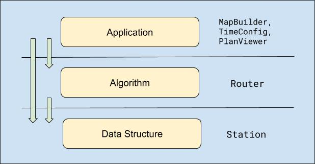

# SG Urban Rail Routing

[](https://circleci.com/gh/mz026/rail-routing)

## Before using it:

This is a command-line application built with Ruby. Please:

1. Make sure you have Ruby 2.6.6 installed in your environment.
2. Install required dependencies with Bundler by:

```
$ bundle install
```

3. Make sure all unit-tests are passed by running:

```
bundle exec rspec spec/
```

## To use it:

This application provides two functionalities:

- Suggest the routes from two stations.
- Suggest the routes from two stations with travelling time considered.


### Suggest the routes from two stations.

Run it by:

```
$ ./bin/route '<from_station>' '<to_station>'
```

e.g.

```
$ ./bin/route 'Holland Village' 'Bugis'
```

The results will be printed on the console like this:

```
Station Travelled: 8
Route: CC21 -> CC20 -> CC19 -> DT9 -> DT10 -> DT11 -> DT12 -> DT13 -> DT14

Instructions:
Take CC from Holland Village(CC21) to Farrer Road(CC20)
Take CC from Farrer Road(CC20) to Botanic Gardens(CC19)
Change from CC to DT
Take DT from Botanic Gardens(DT9) to Stevens(DT10)
Take DT from Stevens(DT10) to Newton(DT11)
Take DT from Newton(DT11) to Little India(DT12)
Take DT from Little India(DT12) to Rochor(DT13)
Take DT from Rochor(DT13) to Bugis(DT14)
Arrived!! 🥳🥳🥳
```

### Suggest the routes from two stations with travelling time considered.

Run it by:

```
$ ./bin/time_route '<from_station>' '<to_station>' '<YYYY-mm-ddTHH:MM>'
```

e.g.

```
$ ./bin/time_route 'Boon Lay' 'Little India' '2020-11-13T19:00'
```

The results will be printed on the console like this:

```
Travelled At: 2020-11-13 19:00:00 +0800
Time Spent: 150 minutes
Station Travelled: 14
Route: EW27 -> EW26 -> EW25 -> EW24 -> EW23 -> EW22 -> EW21 -> CC22 -> CC21 -> CC20 -> CC19 -> DT9 -> DT10 -> DT11 -> DT12

Instructions:
Take EW from Boon Lay(EW27) to Lakeside(EW26)
Take EW from Lakeside(EW26) to Chinese Garden(EW25)
Take EW from Chinese Garden(EW25) to Jurong East(EW24)
Take EW from Jurong East(EW24) to Clementi(EW23)
Take EW from Clementi(EW23) to Dover(EW22)
Take EW from Dover(EW22) to Buona Vista(EW21)
Change from EW to CC
Take CC from Buona Vista(CC22) to Holland Village(CC21)
Take CC from Holland Village(CC21) to Farrer Road(CC20)
Take CC from Farrer Road(CC20) to Botanic Gardens(CC19)
Change from CC to DT
Take DT from Botanic Gardens(DT9) to Stevens(DT10)
Take DT from Stevens(DT10) to Newton(DT11)
Take DT from Newton(DT11) to Little India(DT12)
Arrived!! 🥳🥳🥳
```

## Architecture

The application is architected into three layers. The underlying layers are not aware of the upper layers.

- Config/Application layer: This layer translates the user input and the assets into the desired data, and feed them into the Algorithm layer.
- Algorithm layer: This layer makes use of the underlying graph data structure and perform the algorithms needed to solve the problems. `Router` class belongs to this layer.
- Data structure layer: This layer consist of `Station` class. Which represents the graph data structed needed by the algorithm.



## Algorithms
The whole application is modeled as a [shortest-path problem](https://en.wikipedia.org/wiki/Shortest_path_problem). I use Breadth First Search (BFS) to solve the un-timed problem and Dijkstra Algorithm to solve the timed problem.

- In the un-timed routing problem, the goal of BFS is to find the path with least station travels.
- In the timed routing problem, the goal of Dijkstra Algorithm is to find the path with the least traveling time. The times it takes to travel between each station and exchange lines are modeled as the `weight` in the algorithm.

## API & Details

The API and expected behaviors of the class above are listed by unit-tests. Here's what they look like:

```
Router
  ::new(station_map)
    takes a station map to init
  #route(from: station_name1, to: station_name2)
    returns station list from station_name1 to station_name2
    returns [] if no suitable plan was found
    raises if from or to station not found
    considers exchange station
  #time_route(from:, to:, line_weight_map:, line_changing_cost:)
    calculates route based on weights
    considers line changing cost
    allows default weight by key `__default`
    returns [] if no suitable route

Station
  Map::add(line_code, line_num, name, start_date)
    returns a station
  ::connect(station1, station2, line_code)
    connects the stations and reflects on the #connections
    returns the neighbor stations
```
